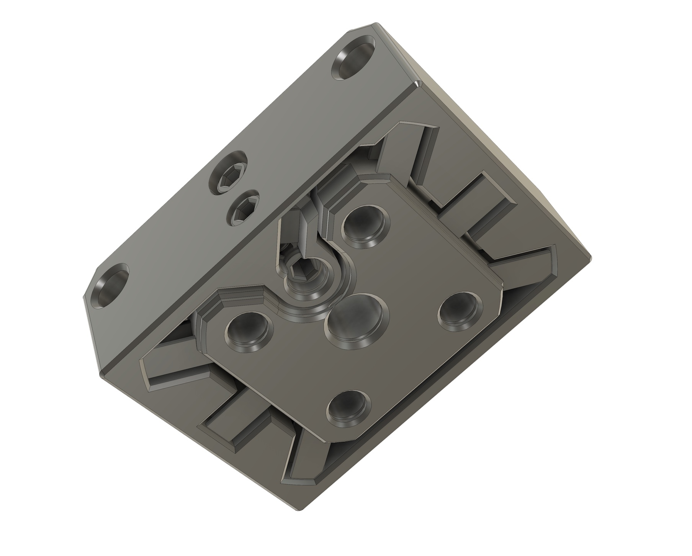
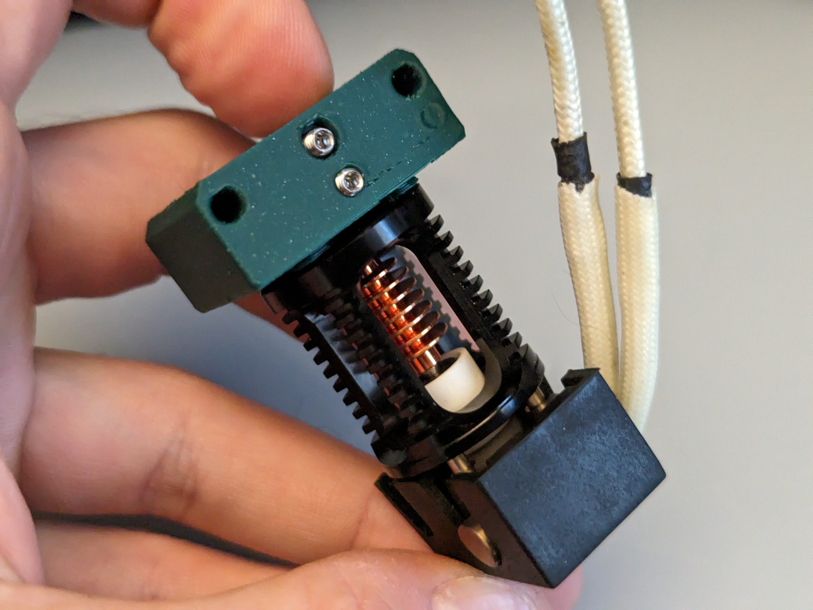
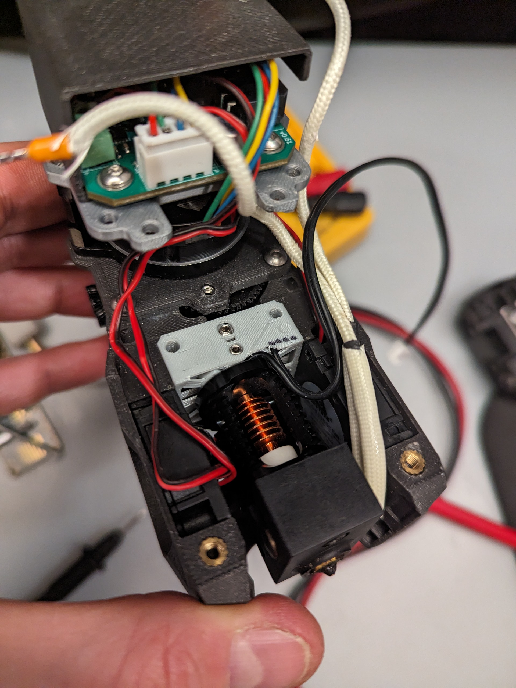
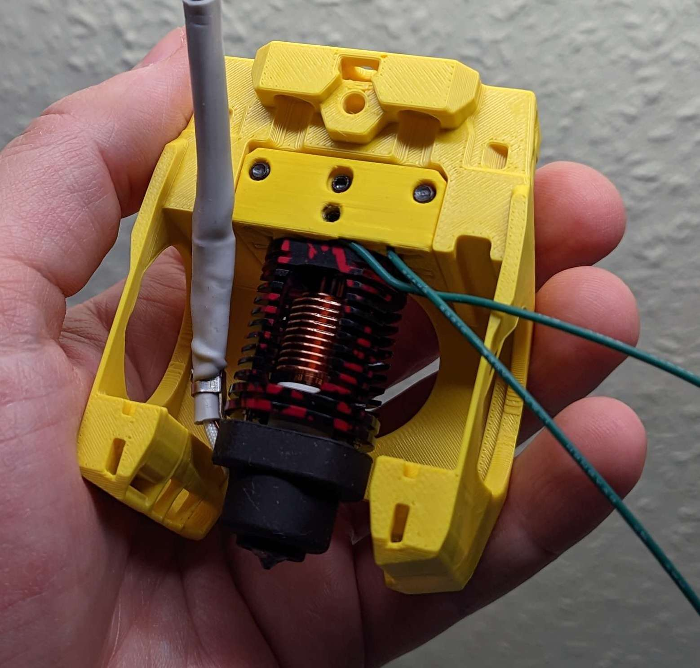
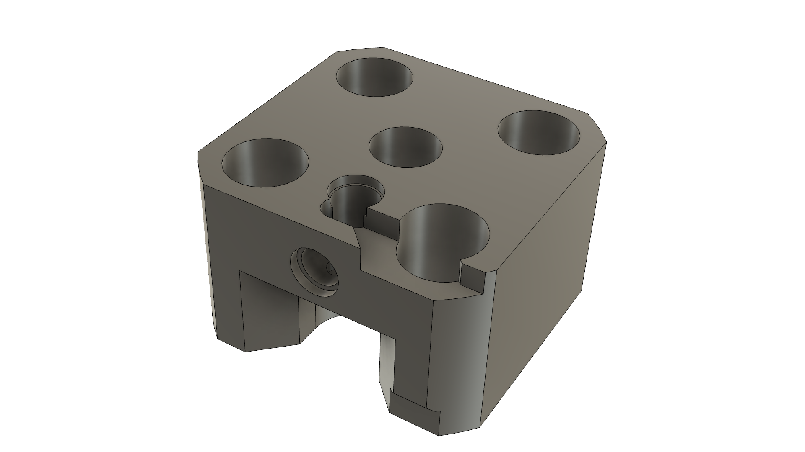
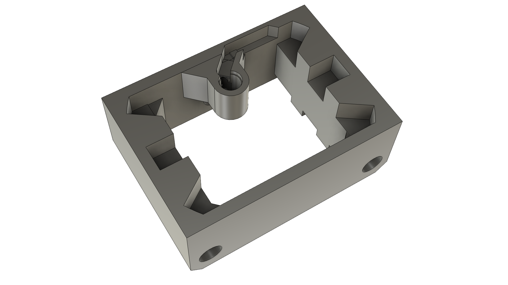
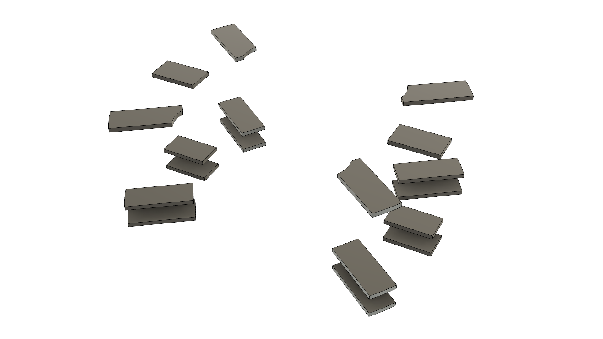
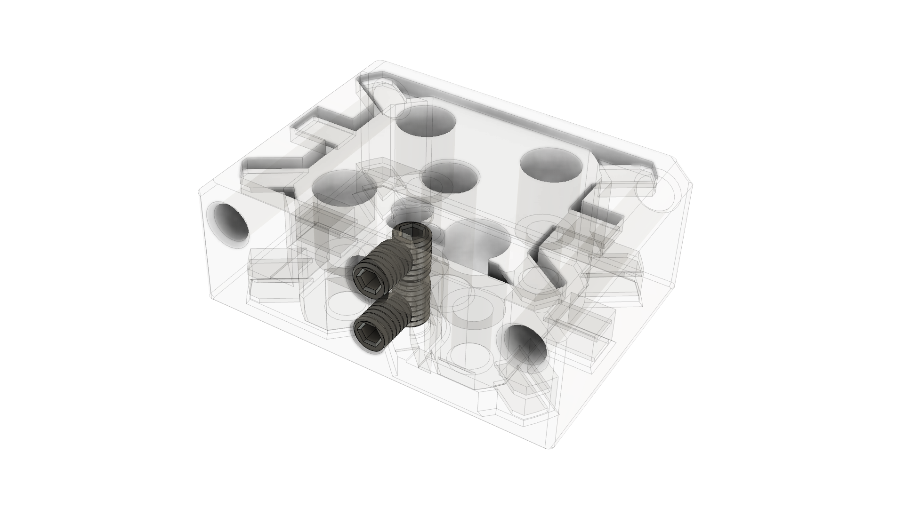
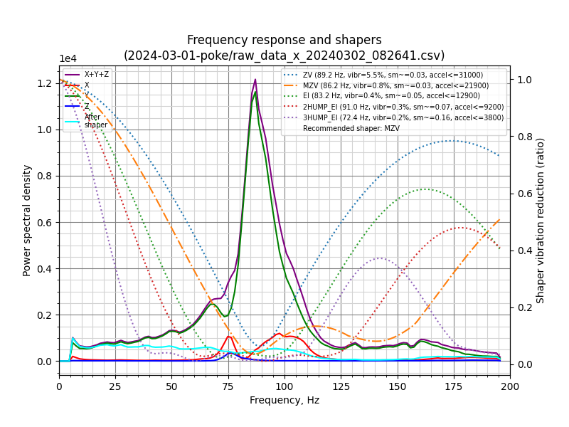
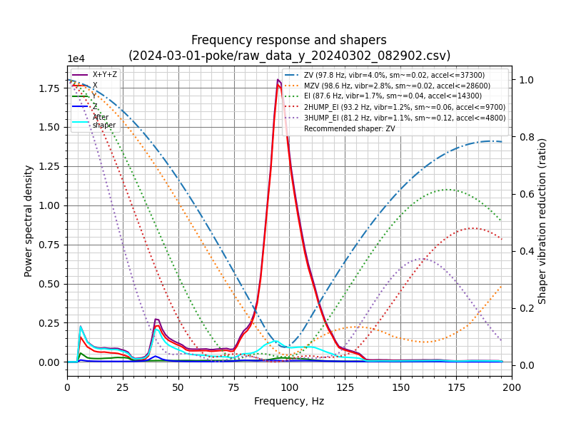

# Poke: the $1 hotend probe

**Poke** is a flexure-based hotend-mount Z probe for [Printers for Ants](https://3dprintersforants.com/).

Total cost is under $1, print time is ~30m, and weight is ~7g.

| In action | View from below |
| - | - |
|  |  |

## What printers are compatible?

Printers that:
* Use the Mini Stealthburner toolhead (or at least share the same hotend mount)
* Have a fully supported bed, like Tri-Zero, Micron, Pandora's Box, SwitchThread, and more
  * Similar to Boop, V0 cantilever beds are a no-go, as they flex too much.
* Have a supported hotend
  * Dragon: :white_check_mark:
  * Revo Voron: not yet, but likely next

Some examples:

| With Dragon | In a Mini Stealthburner | In a MiniSB-compatible cowling |
| - | - | - |
|  |  |  |

The build and installation goes quickly, as only one part is replaced.

## How does it work?

Poke uses:

(1) engineered flexures for constrained up/down motion

(2) set screws that serve triple duty as switch contacts, wire clamps, and preload adjusters.  

An *inner core* fits within an *outer shell*, connected by flexible plastic bridges (*flexures*), and when the hotend presses down, *set screws* break continuity and trigger the probe.  This all happens within one single plastic part.

| Inner Core | Outer Shell | Flexures | Set Screws |
| - | - | - | - |
|  |  |  |  |

The are a ton of ways to enable automatic bed leveling, but **nozzle probing**, where the nozzle tip touches the bed, has real advantages:
* Automatically adjusts after flexplate height changes
* Automatically adjusts after nozzle changes
* Can probe the whole bed area
* Uses simple macros, with no attach/detach macros needed

Lately, [Boop](https://github.com/PrintersForAnts/Boop/tree/main/beta_4), inspired by Voron Tap, has been the premier way to add nozzle probing to [Printers for Ants](https://3dprintersforants.com/), but it comes at a cost: potentially lost travel, a bed shift, added weight, added cost, and worse resonance performance.  

In comparison to Boop, Poke is only 7g vs ~87g (which is a big deal where a toolhead may be 250g!) and only costs $1 vs a $40 Tap kit.

In fairness, hotend support is limited and testing is nowhere near as complete. Hence, the status is Alpha.

## Status: Alpha

What does that mean?

:thumbsup: **Prints well** - for Zruncho at least, at chamber temps, over 10+ hours in 50C+ temps, up to 60C.

:thumbsup: **Documented** - a few people have made them without issue, from just these instructions.

:thumbsup: **Repeatable** - here's the relevant chunks of the an initial `PROBE_ACCURACY` test with 10 samples, which is at microstep-level:

`results: ... range 0.003750 ... standard deviation 0.001008`

:thumbsup: **Clean resonance tests** - Klipper Input Shaper test results seen below.

Test details: Boxed Tri-Zero with custom extrusionless MGN9H X, Hacky Boi toolhead, Papilio Lite extruder, Timmit toolhead board, and custom fixed Boop-center adapter.  Measured with Kusba Pro, at nozzle.

| X | Y |
| - | - |
|  |  |

Beyond 30K accels for X and Y is pretty good.  Expect comparative measurements to come later, against the original fixed hotend mount.

**However**, there are caveats.  As of initial release (March 3 2024), we don't have long-term experience with accuracy or stability.

Plus, hotend support is currently limited - in fact, only Dragon hotends have been tested, and some may never have the space to fit.

This is more of a proof of concept that works, and you should be encouraged to build on it or take the lessons to heart.

## BOM
* **Set Screws**:  4x M3x4 conductive set screws (steel, copper, ... can't be coated alloy or anodized).  M3x3 are fine too, and should help enable ports to smaller spaces.  [Bolt depot link](https://boltdepot.com/Product-Details?product=22896)
* **Wire**:  24AWG zip wire (1.5mm insulation OD, 0.5mm wire ID) works fine.  Any thicker will require mods.
* **Hotend Screws** will be hotend-specific.
  * Dragon: 8mm M2.5 SHCS.   If you have 10-12mm M2.5 handy, adjust the counterbores in the CAD and export.
  * Revo Voron: to come later

## Instructions
* Print the core and spacer using standard Voron settings.  
    * The material must have some flex; ABS is a good choice.
* Install all set screws with formed threads.
    * NOTE: When *forming* threads (using pressure to create threads in small holes in plastic), ensure alignment and push hard at the start.
    * Add upper vertical set screw, until flat with the top surface.  Then do 3 turns (1.5mm)
    * Add lower vertical set screw, until flat with bottom, then do 4 turns (2mm).
    * Add horizontal set screws, until almost flush with outside (with vertical wire channel clear).
* Close the "switch contact" and set the preload.
    * Look at the bottom of the core - the part that faces the hotend.
    * Tighten up to one full turn, until you feel resistance and see the hotend center push away 0.1mm or so from the bottom frame. The tiniest visible amount should be plenty.
    * Push gently on the bottom, while holding the frame, to break the flexure loose.  It may "crack" here from imperfect bridges breaking.
    * The top set screw should move up in the slot, as you press the flexures.  There is 0.4-0.5mm of motion until it hits the max travel, but this should be way more than needed in practice.
* Add wires and tighten horizontal set screws.
    * Strip one end of wire with about 3mm exposed wire length.
    * Feed wire through the open (un-chamfered) internal corner, then over into the space between the set screws.  Lock down the top horizontal screw.  Push down on the wire.  Gently pull tight.
    * Set the other wire length with the same amount exposed.
    * Do the same thing for the bottom wire.
* Add a plug on the other end.
* Test electrical conductivity at the plug end.
    * If no connectivity, turn top set screw slightly.  A bit of resistance (hundreds of ohms) is fine.
    * When you push on the bottom, you should see the circuit open.
* Add spacer and tighten 4x hotend screws.
* Mount on printer!

## Configuration
* Reset your probe’s Z offset.  Since there's low travel until trigger, the new Z offset will depend on the amount of flex in your gantry and toolhead mount.  

## Notes
Core:
* The core is double-notched, so it can be flipped, but by default the wire exit is at the back.
* If you find that the triggering force is too high, you have options to reduce the force:
  * Reduce the preload by adjusting a vertical set screw
  * Clip flexures with flush cutters to reduce the triggering force... there are 18.  
  * Go to the model and remove the inner flexure layer or reduce the flexure width parameter

CAD:
* The main Fusion CAD file uses Configurations, which requires the paid version or a trial to open.  
* Hotend-specific export Fusion files should work on any version.
* The CAD is clean. All sketches, planes, and features are documented, it’s parameterized, and it’s organized via Configurations.  
* New hotend support may be easier than you think, if the hotend has screws in a rectangular grid.

Future work:
* Comparative IS measurements vs original hotend mount
* Long-term stability and probe repeatability testing
* Small internal fillets and chamfers for flexure lifetime and reduced chance of needing breakaway
* A 4mm-ID wave spring at the top might provide more consistent restoring force, especially if the flexure is deformed into the plastic region or experiences force-driven or heat-driven creep.
* Flexure motion limiters

## Support

Like what you see, and want to support more open-source printer development like this?

[Buy me a coffee](https://ko-fi.com/zruncho3d) to show the love and enable future mods and content, stuff like [F0](https://github.com/zruncho3d/f-zero), [T0](https://github.com/zruncho3d/tri-zero), [B0](https://github.com/zruncho3d/boxzero), [X0](https://github.com/zruncho3d/double-dragon), [D0](https://github.com/zruncho3d/DuelingZero), [ZeroPanels](https://github.com/zruncho3d/ZeroPanels), [NoDropNuts](https://github.com/zruncho3d/f-zero/tree/main/STLs/NoDropNuts), [Boop](https://github.com/PrintersForAnts/Boop) improvements, and more!  

For questions, find the Poke user project on the Voron Discord and ask a question.  Don't ping Zruncho.

## Credits

* Flexure layout and concept: `chirpy`
* Flexure proof of concepts that motivated this: `andrewmcgr` (check out [FlexTap](https://github.com/andrewmcgr/FlexTAP)!), `Alexander Þór`.
* Set-screw switch preload and electrical contact design is original - or at least, Z hadn’t seen it before.  But nothing’s truly original anymore, so if you see an earlier reference, set me a note and I'll update this.
* Beta testers that did beta prints: `kevinakasam`, `kyle`, `caza`.
* Gif at the top is courtesy of `kevinakasam`.

:heart: *-Zruncho*

